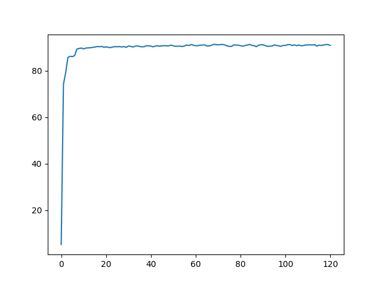
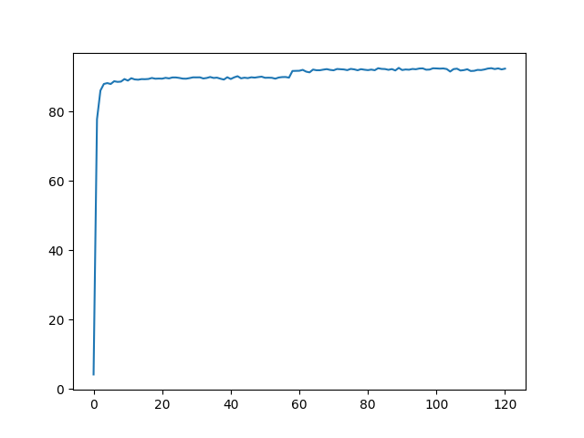
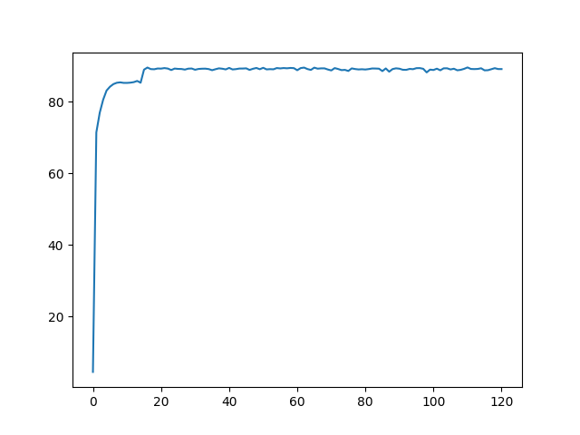
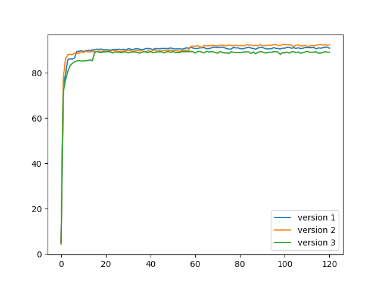

# Rapport sur l'exercice 10

Base utilisée : EMINST, un dérivé de NIST contenant aussi bien des nombres que des lettres.

Etant donné que la base de donnée est fragmentée en plusieurs catégories 
(lettre, nombres, et des mélanges des deux précédents),
j'ai fait le choix de partir sur les lettres pour ne pas être trop redondant avec l'exercice sur MNIST.

### Version 1 
Le réseau de neurones choisi initialement est sous la forme:
- Couche Conv: 4 features 5x5
- Couche Max Pool: 2x2
- Couche Conv: 16 features 5x5
- Couche Max Pool: 2x2
- Couche FC: 256 neurones
- Couche FC: 128 neurones

Avec en sortie 26 valeurs différentes et ReLu comme fonction d'activation.

Cette première version est très proche de LeNet-4 vu dans le chapitre 4, elle 
produit des résultats correct : 91.06 % en moyenne sur les 20 dernières epoch.

### Version 1.01

Ensuite j'ai essayé d'ajouter une couche FC à la fin avec 64 neurones, mais
les résultats étaient trop proches de la première version pour être intéressant.

### Version 2

Donc j'ai ensuite essayé de l'améliorer modifiant la taille du kernel de la 2ᵉ couche
conv de (5, 5) en (3, 3). Ce qui a aussi changé la taille des couches FC qui sont
maintenant respectivement de taille 400 et 200.
Cette modification permet de gagner ~1.1 %. (moyenne des 20 dernières epoch : 92.16 %)

### Version 3

La dernière configuration testée a été de changer la fonction d'activation 
en LeakyReLu avec un coefficient de pente de 0.03.
Cependant les résultats ne semblent pas avoir été énormément impacté.

## Récapitulatif

Voici tous les résultats sur le même graphique.

